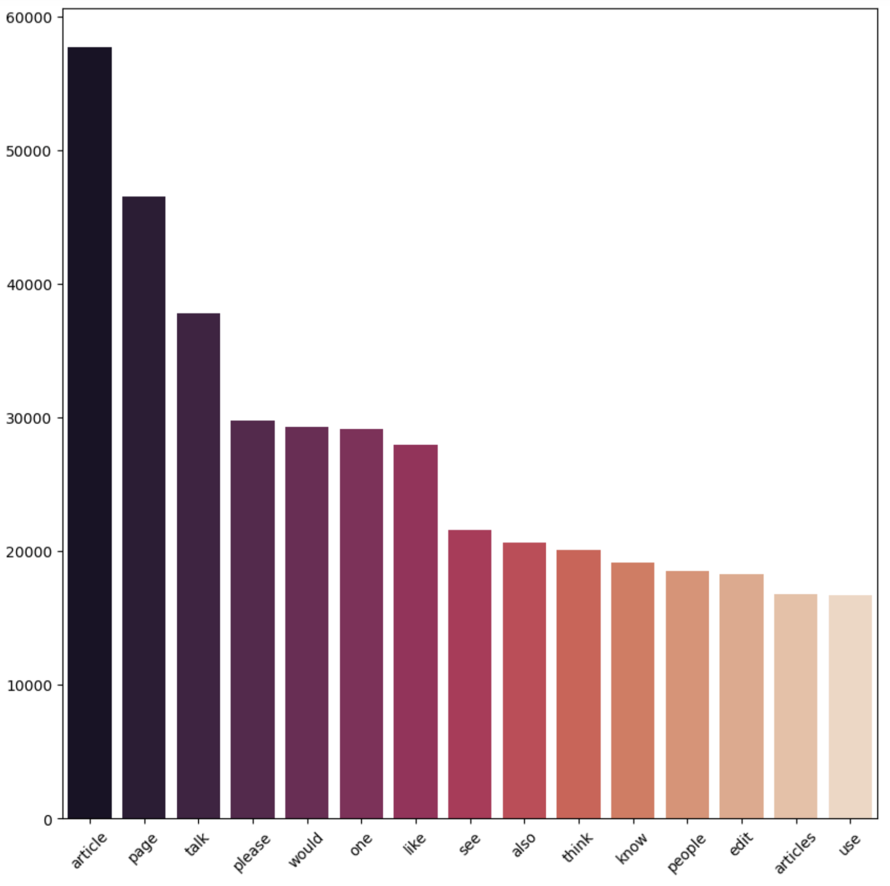
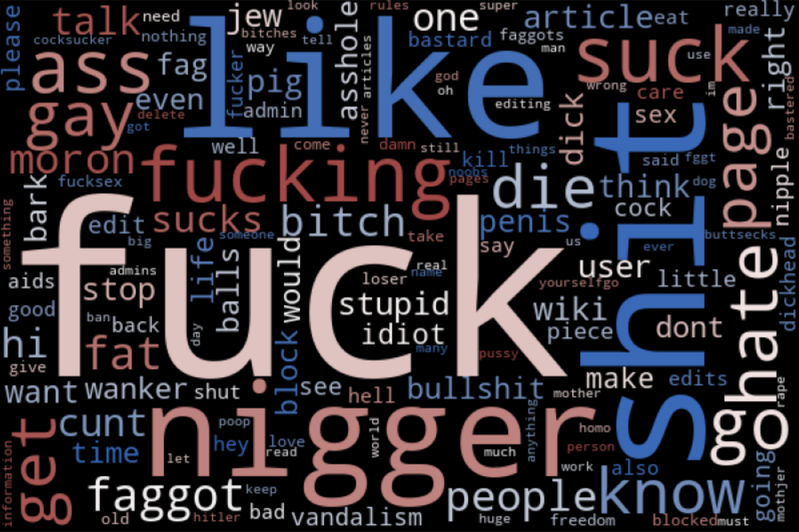
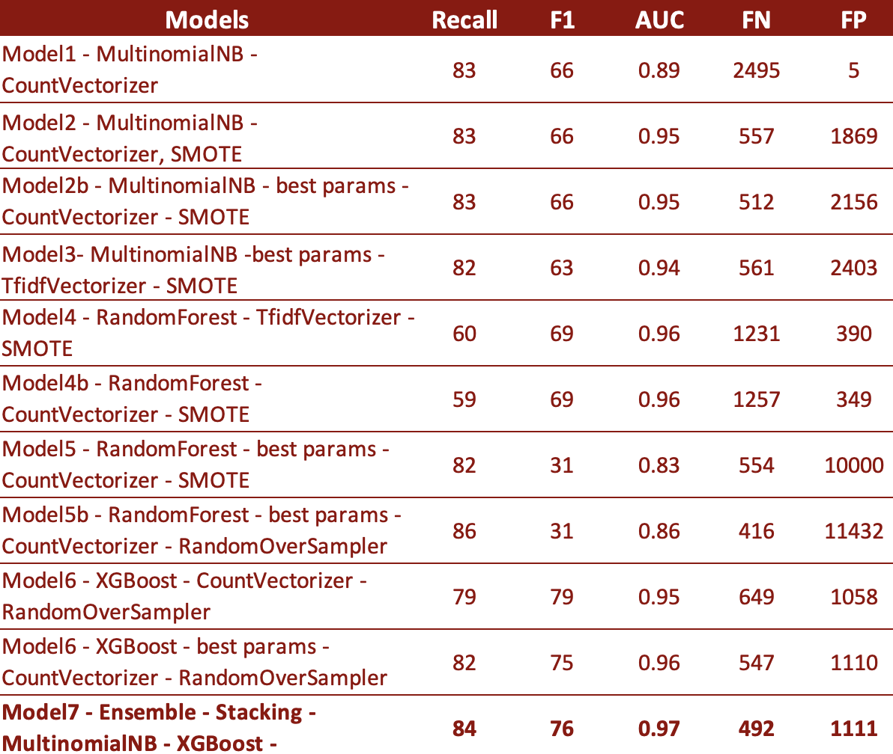
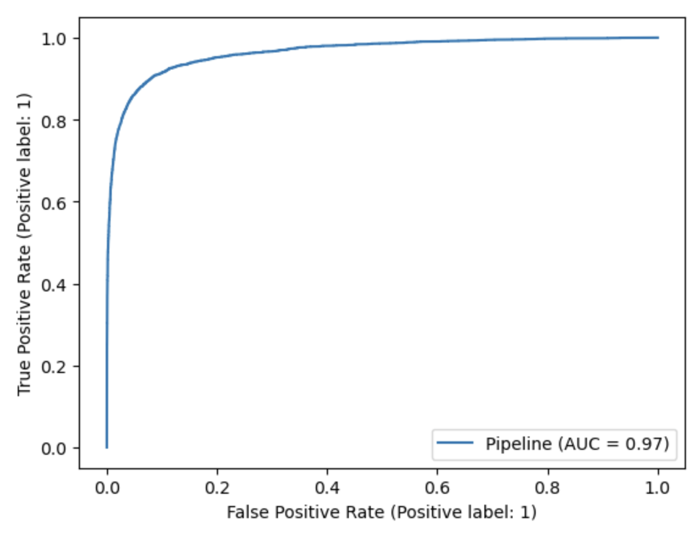
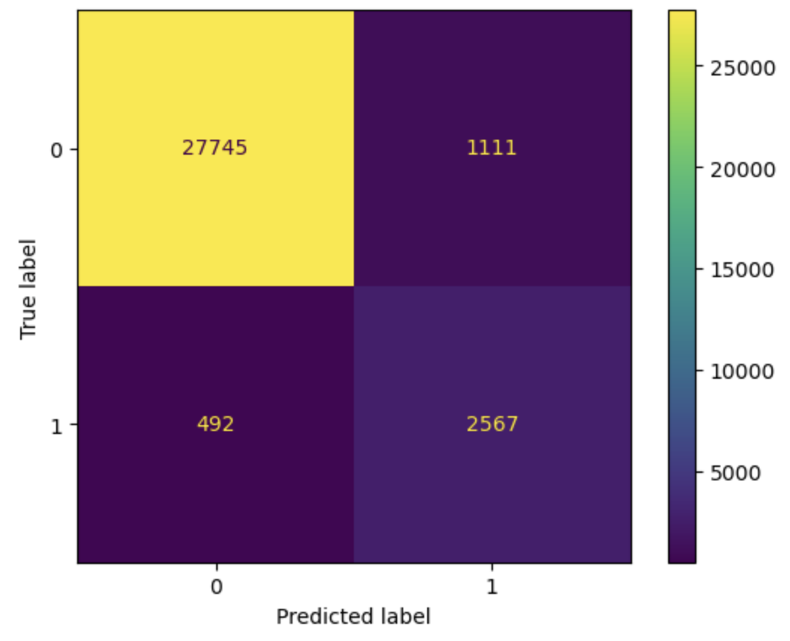

# Toxic Comment Classification with NLP

## Business Case
In today's environment when social media and discussion forums generate enourmous amounts of new comments every second, there is an increased need to monitor user input and catch toxic comments in a timely manner. The sooner these comments are identified the better the measures are that can be put in place to prevent these comments from going unnoticed or getting out of hand.
Toxic comment classification can be useful for businesses in a number of ways. For example, if a business operates a social media platform or an online forum, it may be important to identify and remove toxic comments in order to create a positive and welcoming environment for users. This can help to reduce the risk of users becoming distressed or offended by toxic content, which can lead to negative brand associations and a decrease in user engagement and retention. Additionally, identifying and removing toxic comments can help to prevent the spread of misinformation or hateful ideologies, which can have serious consequences for both the business and society as a whole. In general, toxic comment classification can help businesses to foster a more positive and safe online community, which can ultimately lead to improved brand reputation and customer/user loyalty.

## Business Problem
Company XYZ is operating a website with an online discussion forum. Due to that they are relatively new to the market and thus far don’t have much experience in content moderation. In addition to that their resources for content moderation are also limited, with a high volume of comments being posted in multiple forums at the same time. As a result they have trouble flagging all the toxic comments. Therefore there is a risk of users turning away from their site due to harassment and a toxic environment.
They would like to build a machine learning model which can handle large amounts of data and flag these types of comments in a timely manner, to prevent the spreading of these issues and take the correct disciplinary action against the violators.

## Data

Source:
https://www.kaggle.com/datasets/julian3833/jigsaw-toxic-comment-classification-challenge

I used a kaggle dataset. This contains wikipedia user comments in various areas. I only used the train.csv, that had been provided in this competition.
The dataset contains 159,571 rows and 8 columns, including: id, comment_text, toxic, sever_toxic, obscene, threat, insult, identity_hate. I will be using the comment_text and toxic columns to create a binary classification.
There is a high imbalance 90.5% - 9.5% in normal and toxic classes, this will be addressed in the modeling section by applying SMOTE and RandomOverSampler techniques.

Top 20 tokens in the whole corpus
<p align='center'>
  
</p>
As expedted of wikipedia comments most users are discussing articles and discussing edits, all the words represnted are normal. None of them are toxic.

/Disclaimer: the below frequent toxic word not a representation of my beliefs or ideologies, it's purely just visualizing the most frequently used toxic words in the dataset./ 

Top 20 toxic tokens
<p align='center'>
  
</p>
The above wordcloud of most frequent toxic comments clearly shows that some users use abusive language to harass others, thereby creating a toxic and unwelcoming environment, which would lead to more users either simply not expressing themself on the online platform or leave it altogether.

## Preprocessing
There were no missing values, however the comments contained http links, foreign characters which had to be taken out. For this I used regex patter to remove them from the dataset.
After removing those I lowercased, removed numeric characters, tokenized to split up the document into smaller units, and removed the stopwords and punctuations with nltk. The tokens then been stemmed with SnowballStemmer and in the pipeline I used Count Vectorizer for the base model and later on I changed it to TfidfVectorizer.The tokens were also SMOTEd or RandomOverSampled.
The clean version of the dictionary reduced the number of tokens from 200k+ to 140k.


## Modelling
I used machine learning models, namely: Multinomial Naive Bayes, Random Forest and XGBoost and Ensemble method in my classification project.
These models all work well with large dataset. MultinomialNB is simple and efficient technique for classifying text. Part of the reason I choose this because it's easy to implement and can be trained on relatively large dataset quickly. It is relatively insensitive to the scaling of the input features, which is convenient due to the high dimensionality after the vectorization (140k+).

Random Forest can also handle high-dimensional data well. It is robust to noise in the data and resistant to overfitting. It's easy to implement and tune. It can also perform well without fine-tuning. And lastly it's fast to train and predict, which makes it an optimal choice for large datasets.

And lastly I chose XGBoost as it is fast and it has number of hyperparameter to optimize the model's performance.



Out of all the models it was surprising that RandomForest  with best params didn't do a good job in terms of low F1 scores (31) and extremly high number of false positive cases (10k+), which means that more than 10,000 comments would be flagged as they are toxic when they are not.

The top 3 models are:
* Model2 - recall: 83 | FN: 557
* Model6 - recall: 82 | FN: 547
* Model7 - recall: 84 | FN: 492


### Best Model

<p align='center'>
  
</p>
This last ensemble model performed the best. This model combines the prediction of the MultinomialNB and the XGBoost model with best params. This Stacking model uses the tfidf vectorizer and SMOTE. The resulting model has a high recall score of 84% and an AUC of 0.97 on the test set, with relatively low numbers of false negatives (492) and false positives (1111).
<p align='center'>
  
</p>
Part of the reason I chose this model is becaue this model had the lowest FN - FP pair. It is important to minimize the number of false negatives, because we want to minimize type II errors, users wouldn't be flagged for writting toxic comments, when actually they are.

## Conclusions
This model likely performed well because of the combination of MultinomialNB and XGBoost are able to capture a wide range of patters in the data, allowing it to make more accurate predictions than the previous models. In addition the use of tfidf vectorizer may be able to capture important information about the frequency and importance of different words in the data. SMOTE likely helped to improve the model's performance by better representing the features of the data and addressing class imbalances respectively.

### Limitations
Due to the high imbalance the model might not have had enough toxic data to train on. 
Some of the comments also seem to be  incorrectly classified as toxic in the dataset, however they are just a chain of reactions to some previous toxic comments. Just by quoting someone and pointing out in quote marks that the use of certain toxic words are not suited to the forum, in my opinion doesn't make the comment toxic. If the original comment would be flagged on time, the resulting user reactions would not occur at all.
These models also not taking into account the relationship between words that are frequently used together.

### Next Steps
As a next steps I would like to use word embedding to account for the relationship between words that are used in similar contexts. In addition I would also like to apply neural network and try to create a multi-label classification, as the original dataset contained more target columns, therefore it would be useful if the model could distinguish between differnt type of toxic comments, such as threat, obcene, identity hate, insult.


## Repository Structure
```
├── data
├── src
├── images
├── .gitignore
├── README.md
├── Toxic_Comment_Classification-toxic-stem.ipynb
└── Toxic_Comment_Classification-toxic-lemmatization.ipynb
```
